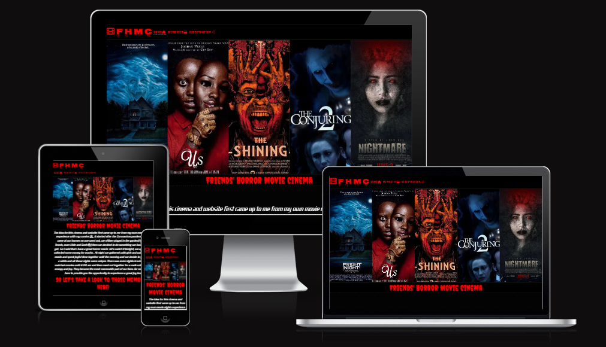

- [Contents](#contents)
- [FHMC](#FHMC)
  + [UX](#ux "UX")
   + [Site Purpose](#site-purpose "Site Purpose")
   + [Site Goal](#site-goal "Site Goal")
   + [Audience](#audience "Audience")
   + [Communication](#communication "Communication")
   + [Current User Goals](#current-user-goals "Current User Goals")
   + [New User Goals](#new-user-goals "New User Goals")
 + [Design](#design "Design")
   + [Colour Scheme](#color-scheme "Color Scheme")
   + [Typography](#typography "Typography")
   + [Imagery](#imagery "Imagery")
 + [Features](#features "Features")
   + [Existing Features](#existing-features "Existing Features")
   + [Future Features](#future-features "Future Features")
 + [Testing](#testing "Testing")
   + [Validator Testing](#validator-testing "Validator Testing")
 + [Technologies Used](#technologies-used "Technologies Used")
   + [Main Languages Used](#main-languages-used "Main Languages Used")
   + [Frameworks, Libraries & Programs Used](#frameworks-libraries-programs-used "Frameworks, Libraries & Programs Used")
 + [Deployment](#deployment "Deployment")
 + [Credits](#credits "Credits")
   + [Content](#content "Content")
   + [Media](#media "Media")
# FHMC

The FHMC site is live, the link to which can be found [HERE](https://zabeenasherzoie.github.io/first-project-FHMC/)
## UX:
### Site Purpose:
Friends' Horror Movie Cinema is a cinema built for those who love spendig time with their friends specialy watching horror movies and playing games all night.
### Site Goal:
The intent of the  website is to introduce our audience to such a cinema and to aid them in getting the most out of their time spending with their friends and giving them the oppurtunity to choose the location, snacks and even the light of the salon.
### Audience:
 It is targeted at an audience of all ages, who's only requirement is a group of great friends.
### Communication:
With a clear & bold design, this information is readily available to all who visit the site. The information is readily available without the need to search, and the pages are marked clearly so the users know in which page they are.
### Current User Goals:
To make regsitration with ease and navigate and interact with the page easily.
### New User Goals:
Get introduced with the cinema and have a great experience with navigation and registration.
# Design:
## Color Scheme:
The colour palette was created with the thought to provide as much contrast as possible.The body background is black to make a good contrast with the ligth red headers and logo to remind the users of horror movies, besides white color is used for the paragraph in the introduction section to provide better contrast and readibility
### Typography:
Nosifer was selected for the main heading or logo on each of the pages, accompanied by Creepster for headers and Kdam Thmor Pro for main paragraph. Which the two first reminds us the texts in horror movies.The contrast between colors is checked in  [HERE](https://webaim.org/resources/contrastchecker/).

### Imagery:
All the imagery on the site, excluding the registeration page background and the home page hero image is my own photography. For the The Hero image and registeration page background I took the images from google and made a collage out of them.
## Features:
### Existing Features:
#### Navigation Bar:
This is included across all three pages, and provides people with an easy reference to navigate between the 'Home', 'Memories' & 'Registration' pages.

#### Landing Page:
This defines the feel of the website, providing the user with an image that they can easily associate to what the company is & does.

#### Intorduction:
Talks about the website and how this idea came to mind.

#### Memory Page:
Includes some memories of friends who has experienced this cinema.

#### Registration Page:
Which you can input your email and let us manager other stuff if you want to have such an experiene.

### Future Features:
- An Experiences page
- A Movies page to show available movies
## Testing:
The media queries were very challenging. It took a lot of trial & error in the Chrome Dev tool to adjust everything accordingly so that it would not display horribly when the page was to be resized.
I faced problem figuring out the right rules for the form  responsivity issue specialy for less than 500px wide screens then I figured out to give the select element a float rigth and to put the form element inside a div.
I realised that my memory page was loading slowly due to images sizes so I changed thier format from jpg and png to webp and it solved the problem.
While running the html files through W3C validator, upon initial run, some sections failed. Because I used empty h1's to place some icons througout the page once I removed them I passed it.
I also got stuck with the div elements' contents overriding the footer and I tried so many approach but then realized that the solution was very easy and I add margins the problem was solved.
### Validator Testing:
- Html files pass through the [W3C validator](https://validator.w3.org/) with no issues found.

- Html files pass through the [Jigsaw validator](https://jigsaw.w3.org/css-validator/) with no issues found.

- Page has an excellent Accessibility rating in Lighthouse

- Tested the site opens in Brave, Chrome & Safari without issues.
- All links open to external pages as intended.
## Technologies Used:
### Main Languages Used:
- HTML5
- CSS3

### Frameworks, Libraries & Programs Used:
- Google Fonts - for the font families: Creeper, Nosifer & Kdam Thmor Pro. 
- Font Awesome - to add icons to the social links in the header nav and footer element.
- GitPod - to creat my html files & styling sheet before pushing the project to Github.
- GitHub - to store my repository for submission.
- Adobe creative cloud express for making collages.
- Am I Responsive? - to ensure the project looked good across all devices.
## Deployment:
The site was deployed to GitHub pages. The steps to deploy are as follows:
- In the GitHub repository, navigate to the Settings tab
- Go to the page section.
 From the source section drop-down menu, select the main Branch
- Once the main branch has been selected, the page will be automatically refreshed with a detailed ribbon display to indicate the successful deployment.
- The live link can be found [HERE-->FHMC](https://zabeenasherzoie.github.io/first-project-FHMC/)
## Credits:

### Content:
As my knowledge of implementation is limited at this point of my learning journey, I took inspiration for the design of the memory page, along with the display of the social links in the footer element from the 'love running'project
My mentor [Malia Havlicek](https://github.com/maliahavlicek) helped me understand flexbox which was very help full in building a responsive webpage.
### Media:
The home page image and the registration page's background are collages I made by  Adobe Creative Cloud Express using some Movie Posters I searched in Google.
All other images in the memory page is my own media and photography.

